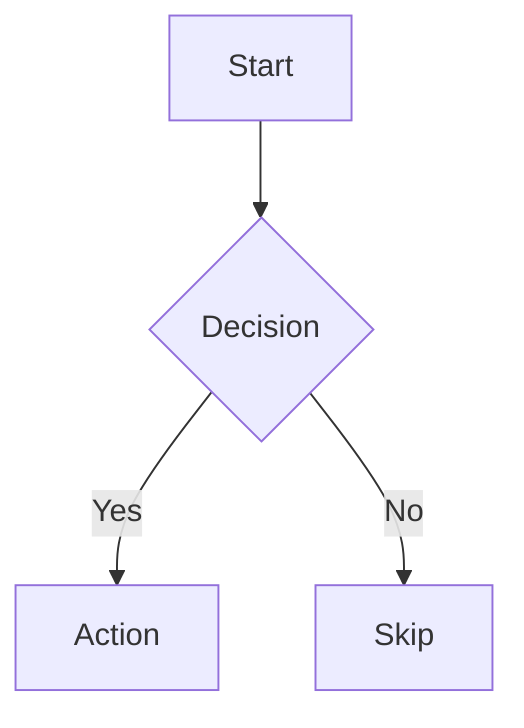

## Purpose

This skill teaches agents the complete Obsidian Flavored Markdown specification — the set of syntax extensions that Obsidian adds on top of standard CommonMark and GitHub Flavored Markdown. These extensions are not valid in plain Markdown editors and must be written correctly to work in Obsidian.

Standard Markdown knowledge is assumed. This skill covers only the Obsidian-specific additions: wikilinks, embeds, callouts, properties (frontmatter), block IDs, comments, and Obsidian-specific formatting. Agents that generate Markdown without this skill will produce notes that look correct in a plain editor but break Obsidian's linking, embedding, and graph features.

This skill is the **foundation** of all Obsidian-related work in this repository. Other skills such as `obsidian-links`, `obsidian-frontmatter`, and `obsidian-note-builder` build on top of the syntax defined here.

## When to Use

Invoke this skill when:

- The user asks to create a new note in Obsidian
- The user wants to add links between notes using the `[[wikilink]]` format
- The user needs to embed content from another note, image, or PDF
- The user wants to add callouts (highlighted info blocks) to a note
- The user needs to set frontmatter properties (tags, aliases, cssclasses, custom fields)
- The user wants to link to a specific heading or block within a note
- The user asks to create a note that "links to" or "is linked from" another note
- The agent is generating or editing any `.md` file that will live inside an Obsidian vault
- The user mentions Obsidian-specific features: graph view, backlinks, MOC, Zettelkasten, daily notes

Do NOT use this skill when:

- The user is generating Markdown for GitHub, a blog, or any non-Obsidian context
- The user needs to validate that existing links point to real notes — use `obsidian-links` instead
- The user needs to standardize frontmatter formatting and naming — use `obsidian-frontmatter` instead

## Workflow

### Step 1: Identify the Note Type and Required Syntax

Before writing, identify what kind of note the user needs:

| Note type | Syntax features likely needed |
|-----------|-------------------------------|
| Meeting note | Frontmatter, wikilinks to people/projects, tasks |
| Daily note | Frontmatter, embeds, inline tags |
| MOC (Map of Content) | Wikilinks, headings, embedded notes |
| Atomic concept note | Frontmatter, block IDs, wikilinks |
| Reference/resource note | Frontmatter with source, tags, wikilinks |
| Canvas-linked note | Frontmatter, block IDs for precise embeds |

### Step 2: Write the Frontmatter (Properties)

Always place a YAML frontmatter block at the very top of the file, before any other content:

```yaml
---
title: My Note
date: 2024-01-15
tags:
  - project
  - active
aliases:
  - Alternative Title
cssclasses:
  - custom-class
---
```

Frontmatter rules:
- The `---` delimiters must be the very first and last characters of the block with no blank lines before the opening `---`
- `tags` must be a YAML list (one tag per line with `- ` prefix) — never use inline format `[tag1, tag2]`
- `aliases` defines alternative note names for Obsidian's link suggestion system
- `cssclasses` applies custom CSS classes to the note in reading view
- Custom properties (e.g., `status: active`) are valid and appear in the Properties panel

### Step 3: Write Internal Links (Wikilinks)

Use wikilinks for all internal vault connections:

```markdown
[[Note Name]]                          Link to note by name
[[Note Name|Display Text]]             Custom display text
[[Note Name#Heading]]                  Link to a specific heading
[[Note Name#^block-id]]                Link to a specific block
[[#Heading in same note]]              Link to heading in the current note
```

Key rules:
- Use `[[wikilinks]]` for internal notes — Obsidian tracks renames automatically
- Use standard `[text](url)` Markdown links for all external URLs
- Never use wikilinks for external URLs
- Link text is optional — `[[Note]]` displays the note name as the link text

### Step 4: Embed Content

Prefix any wikilink with `!` to embed its content inline:

```markdown
![[Note Name]]                        Embed the full note
![[Note Name#Heading]]                Embed only a section of a note
![[Note Name#^block-id]]              Embed a specific block
![[image.png]]                        Embed an image
![[image.png|300]]                    Embed an image with fixed width (pixels)
![[document.pdf]]                     Embed a PDF
![[document.pdf#page=3]]              Embed a specific PDF page
```

### Step 5: Add Callouts

Callouts are highlighted info blocks built on top of Markdown blockquotes:

```markdown
> [!note]
> This is a standard note callout.

> [!warning] Custom Title
> Callout with a custom title overriding the type name.

> [!tip]+ Expanded by default
> The + makes this callout expanded. Use - to make it collapsed by default.

> [!faq]- Collapsed by default
> This callout starts collapsed. Click the title to expand.
```

Common callout types: `note`, `tip`, `warning`, `info`, `example`, `quote`, `bug`, `danger`, `success`, `failure`, `question`, `abstract`, `todo`.

Callouts can be nested:
```markdown
> [!info]
> Outer callout.
> > [!warning]
> > Nested callout inside the outer one.
```

### Step 6: Define and Link Blocks

A block is any paragraph, list item, heading, or code block. Add a unique block ID to make it linkable:

```markdown
This paragraph can be embedded or linked to from anywhere in the vault.
^my-block-id
```

For lists and blockquotes, place the ID on the line immediately following the block:

```markdown
> A quoted passage that needs to be linkable.

^quote-block-id
```

Block IDs must contain only letters, numbers, and hyphens. They must be unique within the vault.

### Step 7: Add Tags and Comments

Inline tags can appear anywhere in the body of a note:

```markdown
#tag                           Inline tag
#nested/tag                    Nested tag hierarchy
#project/alpha/milestone-1     Deep nesting is supported
```

Tag naming rules: tags may contain letters, numbers, underscores, hyphens, and forward slashes. They must not start with a number. Tags defined in frontmatter and inline tags both appear in Obsidian's tag panel.

Comments are completely hidden in reading view:

```markdown
This text is visible. %%This comment is hidden in reading view.%%

%%
This entire multi-line block
is hidden in reading view.
%%
```

### Step 8: Apply Obsidian-Specific Formatting

Highlight syntax (not standard Markdown):

```markdown
==Highlighted text==
```

Math blocks (LaTeX, rendered by MathJax):

```markdown
Inline: $e^{i\pi} + 1 = 0$

Block:
$$
\frac{a}{b} = c
$$
```

Diagrams (Mermaid, rendered natively in Obsidian):

````markdown

````

To link Mermaid node IDs to vault notes, append: `class NodeName internal-link;`

Footnotes:

```markdown
Text with a footnote[^1].

[^1]: Footnote content here.

Inline footnote^[This footnote is defined inline].
```

## Critical Rules

**NEVER:**
- Mix wikilinks and markdown links in the same context — wikilinks for internal notes, markdown links for external URLs only
- Use inline tag format in frontmatter YAML: `tags: [tag1, tag2]` — always use the list format with dashes
- Add a space before the opening `---` of frontmatter — it must be the absolute first line of the file
- Invent wikilink targets that may not exist in the vault — use `obsidian-links` to validate targets
- Use `[[wikilinks]]` to link to external URLs — they will not work as expected
- Place block IDs immediately before a blank line — the ID must follow the block on the next line without any gap

**ALWAYS:**
- Use `[[wikilinks]]` for all internal vault note references
- Place frontmatter at the very top of the file — no content before the opening `---`
- Use YAML list format for all multi-value properties: `tags`, `aliases`, `cssclasses`
- Test that wikilink targets exist using `obsidian-links` when creating notes with links
- Use `==highlight==` for Obsidian-specific highlights — the `<mark>` HTML tag also works but is less portable
- Ensure block IDs are unique within the note — duplicates cause linking to fail silently

## Example Usage

### Example 1: Create a meeting note

```
User: Create a meeting note for my call with Sarah about the Q3 roadmap
```

Output:

```markdown
---
date: 2026-04-03
type: meeting
tags:
  - meeting
  - q3
  - roadmap
attendees:
  - "[[Sarah Johnson]]"
status: inbox
---

# Meeting with Sarah — Q3 Roadmap

## Context

> [!info] Related
> See [[Q3 Roadmap MOC]] and [[Sarah Johnson]] for background.

## Key Points

- Discussed scope for Q3 delivery milestones
- Alignment needed on [[Product Strategy 2026]]
- Sarah raised concerns about timeline for [[Feature Alpha]]

## Action Items

- [ ] Share updated roadmap draft — due [[2026-04-07]]
- [ ] Schedule follow-up with engineering

## Open Questions

- What is the budget approved for Q3?

^meeting-sarah-q3-2026
```

---

### Example 2: Add a callout with an embedded section

```
User: Add a warning callout to this note and embed the risks section from another note
```

Output:

```markdown
> [!warning] Review Before Proceeding
> This section depends on decisions logged in [[Decision Log#Architecture Choices]].

![[Risk Register#Current Risks]]
```

---

### Example 3: Create a note with block IDs for precise linking

```
User: Write a note about event sourcing that other notes can link to specific sections
```

Output:

```markdown
---
tags:
  - architecture
  - event-sourcing
aliases:
  - Event Sourcing Pattern
---

# Event Sourcing

Event sourcing captures all state changes as a sequence of immutable events.
^event-sourcing-definition

## When to Use

Apply event sourcing when the audit trail of state changes is as important as the current state.
^event-sourcing-when-to-use

## Trade-offs

Higher complexity in query patterns; enables full replay and temporal queries.
^event-sourcing-tradeoffs
```

Other notes can now embed `![[Event Sourcing#^event-sourcing-definition]]` to pull exactly the definition paragraph.
